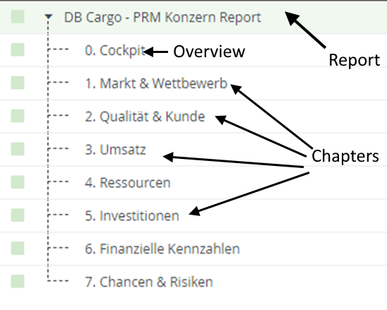

# Method: Key figures as a list (instead of architecture)

Requirements

  DB KeMa Project:
    
    KPIs can be defined centrally and decentrally
    Decentralized KPIs inherit attributes from central KPIs, which can only be changed on the central KPIs.
    Decentralized KPIs contain additional editable attributes.
    The relation between central and decentral KPI is 1-to-many.
    Central KPI and it's related decentral KPIs can be in different categories or under different KPIs in the hierarchy.
    Centralized defined attributes are shown on decentral attributes.
    The publishing/approval workflows of centralized and decentralized KPIs are independent. They can be released independently.
    
    Assumptions/Comments to KPIs:
        Central KPIs are defined by DB AG.
        Decentral KPIS are defined in communities ("Geschäfts-spezifisch").
    Reports and report chapters:
    

         Reports consist of multiple report chapters
         Report chapters are connected to KPIs
         Reports and report chapters can have their own attributes, like name, description, status (no customer requirement)
         The report chapter "0. Cockpit" contains an overview of the content (names of chapters and kpi ) of the report chapters below will be replaced with the graphical representation on the report node
         
         
     Default values (e. g. "not maintained", "N/A") for not maintained attributes (filled at the object creation). Behavior like "recommended" attribute. (see #30207)
     KPI attributes (see also PBI method extension):
         Add Formel
         "Einheit" needs to be a customizable DropDown
         see attributes/method excel below or referenced in the PBI #30162.
        
   General Symbio:
   
          KPIs are shown in a hierarchy (DB NETZ, Satair, DB KeMa)
          The hierarchy consists of categories and KPIs with the structure rule: category -> KPI -> KPI
          In Detail Content it is also possible to link KPIs. KPI -> KPI (related KPI)
          KPIs need to be moved to an own main facet (KPIs today are part of the strategy facet)
          KPIs can be managed with and without a hierarchy (architecture) - this will be controlled by an feature flag
          If possible, keep the object type KPI unchanged. 
          New attributes are implemented as extensions of the existing object type
          (otherwise already existing KPIs need to be converted - ! complexity on connected objects, manuals, fact sheets, etc. !)
          
          
Remarks:
          Need to pay attention to a clear meaning of the terms (Report/Bericht, etc.) Proposal: Use the terms Journal/Buch instead of "report".
          (alternatively rename the report section and objects regarding reporting to business intelligence)
          
Solution Proposal:

    KPIs will have 3 relations
          Hierarchy (parent-relation)
          Derived from (central/decentral)
          In relation to (general independent KPI connections)
    Visualization of the derived from relation: decentral KPI contains a group with the connection to the central KPI (single object only). 
          Detail information of the central KPI only be clicking on the link in the detail content. 
          The group needs to be hiddenable.
          The group should be placed in the detail content directly below the name group.
    New Object types with relation to KPIs
          Report -> Report Chapter (hierarchy)
          Report chapter -> KPIs (assignment in detail content)

Further documentation:

Requirement documentation can be found here:
Kick-Off presentation with time schedule and high level requirements:
https://ploetzzeller.sharepoint.com/sites/projects/Freigegebene%20Dokumente/Deutsche%20Bahn/DB%20AG%20-%20Performance%20Management%20ET1/01_Project%20Management/2020-05-07_Kick-Off-Kennzahlen-Master_Planung.pptx?web=1
Attributes-Excel:
https://ploetzzeller.sharepoint.com/:x:/s/projects/EcLxRm2NQAFOjnt5ZB2cYGQB8GBJaktGkwIqWpNMdSOPBA?e=8yHDIR

Demo-Environment:
https://pz.symbioweb.com/Customer/KPIFeatureTest
Old: https://pz-sales.symbioweb.com/pzs-Zeller/KennzahlenMaster

   
