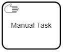
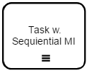
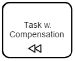
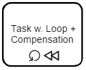

# BPMN tasks

## Introduction

Tasks are atomic pieces of *work* within a *business process*. They are - besides the *sub-processes* and *call activities* - a graphical representation of **Activities**.

Tasks can accure with different types and with different markers.

All task types can be combined with all task markers.

### The task types, that are defined by BPMN are:
- none
- service
- send
- receive
- receive and instantiate process
- manual
- user
- business role
- script

#### The Symbio legacy definition for tasks is:
*definition:* <code>OT_FUNC</code>
*shape:* <code>ST_FUNC</code>

| No. | JSON&nbsp;request&nbsp;/&nbsp;definition | JSON&nbsp;request&nbsp;/&nbsp;shape | Graphic display | BPMN definition | BPMN display |
|-----|---------------------------|----------------------|-----------------|-----------------|--------------|
| 1 | <code>"properties": {</code> <code>&nbsp;&nbsp;"type": "func",</code> <code>&nbsp;&nbsp;"kind": "OBJ"</code> <code>}</code>  | <code>"properties": {</code> <code>&nbsp;&nbsp;"type": "func"</code> <code>}</code>  |  | </code>&lt;task&gt;...&lt;/task&gt;</code>  |  |
| 2 | <code>"properties": {</code> <code>&nbsp;&nbsp;"type": "func",</code> <code>&nbsp;&nbsp;"kind": "OBJ",</code> <code>&nbsp;&nbsp;"funcType": "service"</code> <code>}</code>  |  <code>"properties": {</code> <code>&nbsp;&nbsp;"type": "func"</code> <code>}</code>  |  | </code>&lt;serviceTask&gt; ... &lt;/serviceTask&gt;</code>  |   |
| 3 |  <code>"properties": {</code> <code>&nbsp;&nbsp;"type": "func",</code> <code>&nbsp;&nbsp;"kind": "OBJ",</code> <code>&nbsp;&nbsp;"funcType": "send"</code> <code>}</code>  |  <code>"properties": {</code> <code>&nbsp;&nbsp;"type": "func"</code> <code>}</code>  |  |  </code>&lt;sendTask&gt; ... &lt;/sendTask&gt;</code>  |  |
| 4 |  <code>"properties": {</code> <code>&nbsp;&nbsp;"type": "func",</code> <code>&nbsp;&nbsp;"kind": "OBJ",</code> <code>&nbsp;&nbsp;"funcType": "receive"</code> <code>}</code>  |  <code>"properties": {</code> <code>&nbsp;&nbsp;"type": "func"</code> <code>}</code>  |  |  </code>&lt;receiveTask&gt; ... &lt;/receiveTask&gt;</code>  |   |
| 5 |  <code>"properties": {</code> <code>&nbsp;&nbsp;"type": "func",</code> <code>&nbsp;&nbsp;"kind": "OBJ",</code> <code>&nbsp;&nbsp;"funcType": "user"</code> <code>}</code>  |  <code>"properties": {</code> <code>&nbsp;&nbsp;"type": "func"</code> <code>}</code>  |  |  </code>&lt;userTask&gt; ... &lt;/userTask&gt;</code>  |   |
| 6 |  <code>"properties": {</code> <code>&nbsp;&nbsp;"type": "func",</code> <code>&nbsp;&nbsp;"kind": "OBJ",</code> <code>&nbsp;&nbsp;"funcType": "manual"</code> <code>}</code>  |  <code>"properties": {</code> <code>&nbsp;&nbsp;"type": "func"</code> <code>}</code>  |  |  </code>&lt;manualTask&gt; ... &lt;/manualTask&gt;</code>  |   |

### The task markers, that are defined by BPMN are:
- none
- loop
- parallel multiple
- sequential multiple
- compensation
- compensation loop

| No. | JSON&nbsp;request&nbsp;/&nbsp;definition | JSON&nbsp;request&nbsp;/&nbsp;shape | Graphic display | BPMN definition | BPMN display |
|-----|---------------------------|----------------------|-----------------|-----------------|--------------|
| A | <code>"properties": {</code> <code>&nbsp;&nbsp;"type": "func",</code> <code>&nbsp;&nbsp;"kind": "OBJ"</code> <code>}</code>  | <code>"properties": {</code> <code>&nbsp;&nbsp;"type": "func"</code> <code>}</code>  |  | </code>&lt;task&gt; ... &lt;/task&gt;</code>  |  |
| B | <code>"properties": {</code> <code>&nbsp;&nbsp;"type": "func",</code> <code>&nbsp;&nbsp;"kind": "OBJ",</code> <code>&nbsp;&nbsp;"funcMarker": "loop"</code> <code>}</code>  | <code>"properties": {</code> <code>&nbsp;&nbsp;"type": "func"</code> <code>}</code>  |  | </code>&lt;task&gt; ... &lt;standard-  LoopCharacteristics /&gt;  ... &lt;/task</code>  |  |
| C | <code>"properties": {</code> <code>&nbsp;&nbsp;"type": "func",</code> <code>&nbsp;&nbsp;"kind": "OBJ",</code> <code>&nbsp;&nbsp;"funcMarker": "parallelMultiple"</code> <code>}</code>  | <code>"properties": {</code> <code>&nbsp;&nbsp;"type": "func"</code> <code>}</code>  |  | </code>&lt;task&gt; ... &lt;multiInstance- LoopCharacteristics /&gt;  ... &lt;/task&gt;</code>  |  |
| D | <code>"properties": {</code> <code>&nbsp;&nbsp;"type": "func",</code> <code>&nbsp;&nbsp;"kind": "OBJ",</code> <code>&nbsp;&nbsp;"funcMarker": "sequentialMultiple"</code> <code>}</code>  | <code>"properties": {</code> <code>&nbsp;&nbsp;"type": "func"</code> <code>}</code>  |  | </code>&lt;task&gt; ... &lt;multiInstance- LoopCharacteristics isSequential="true" /&gt;  ... &lt;/task&gt;</code>  |  |
| E | <code>"properties": {</code> <code>&nbsp;&nbsp;"type": "func",</code> <code>&nbsp;&nbsp;"kind": "OBJ",</code> <code>&nbsp;&nbsp;"funcMarker": "compensation"</code> <code>}</code>  | <code>"properties": {</code> <code>&nbsp;&nbsp;"type": "func"</code> <code>}</code>  |  | </code>&lt;task isFor- Compensation="true"&gt;  ... &lt;/task&gt;</code>  |  |
| F | <code>"properties": {</code> <code>&nbsp;&nbsp;"type": "func",</code> <code>&nbsp;&nbsp;"kind": "OBJ",</code> <code>&nbsp;&nbsp;"funcMarker": "compensationLoop"</code> <code>}</code>  | <code>"properties": {</code> <code>&nbsp;&nbsp;"type": "func"</code> <code>}</code>  |  | </code>&lt;task isFor- Compensation="true"&gt; ... &lt;standard-  LoopCharacteristics /&gt;  ...&lt;/task&gt;</code>  |  |
